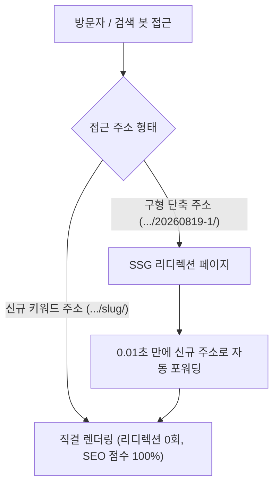

블로그를 운영하다 보면 누구나 한 번쯤 <strong>"URL 주소를 어떻게 설계해야 검색엔진 최적화(SEO)와 방문자 유입에 가장 유리할까?"</strong>라는 고민에 부딪히게 됩니다.

처음에는 단순히 날짜와 번호로 구성된 <code>/posts/20260819-1/</code>과 같은 주소를 사용하기 쉽습니다. 관리가 편하고 파일 정렬이 깔끔하기 때문입니다. 하지만 블로그의 규모가 커지고 네이버 서치어드바이저, 구글 서치콘솔, 빙(Bing)과 같은 검색 로봇이 문서를 색인하기 시작하면, 단순한 숫자 나열형 URL은 <strong>검색 키워드 가중치 상실</strong>과 <strong>클릭률(CTR) 저하</strong>라는 치명적인 한계에 직면하게 됩니다.

이번 글에서는 기존의 날짜형 URL 체계를 <strong>`{년월일-채번}-{핵심키워드}` 하이브리드 슬러그</strong>로 성공적으로 개편한 실제 엔지니어링 과정과, 서버 설정이 불가능한 GitHub Pages(Next.js SSG) 정적 호스팅 환경에서 <strong>구형 링크를 신규 링크로 0.01초 만에 연결하는 3중 리디렉션 구축법</strong>, 그리고 <strong>네이버 서치어드바이저의 수집 제한 및 트레일링 슬래시(/) 경고를 원천 해결한 실전 노하우</strong>를 상세히 공유합니다.

---

## 📌 목차
1. [왜 단순 날짜형 URL에서 키워드 슬러그로 전환해야 하는가?](#heading-0)
2. [정적 호스팅(GitHub Pages)의 리디렉션 난제와 3중 방어선 구축](#heading-1)
3. [네이버 서치어드바이저 '리디렉션 주의(⚠️)'와 수집 제한 원인 분석](#heading-2)
4. [트레일링 슬래시(/)와 검색 로봇 수집 효율 극대화 실천법](#heading-3)
5. [개편 전후 핵심 비교 및 최종 체크리스트](#heading-4)

---

## 1. 왜 단순 날짜형 URL에서 키워드 슬러그로 전환해야 하는가?

검색 엔진 로봇(Googlebot, Yeti 등)은 웹페이지를 색인할 때 본문 텍스트뿐만 아니라 <strong>URL 경로에 포함된 영문 단어</strong>에 매우 높은 검색 가중치를 부여합니다.

### 💡 기존 방식과 신규 하이브리드 방식 비교

| 구분 | AS-IS (기존 날짜형) | TO-BE (하이브리드 키워드 슬러그) |
| :--- | :--- | :--- |
| <strong>URL 예시</strong> | `/posts/20260819-1/` | `/posts/20260819-1-ai-alter-framework/` |
| <strong>검색 로봇 인식</strong> | 단순 날짜 숫자로 인식 (키워드 힌트 0%) | `ai`, `alter`, `framework` 핵심 키워드 즉시 색인 |
| <strong>소셜 공유 신뢰도</strong> | 링크만 보고 내용 유추 불가능 (클릭률 저하) | 주소만 봐도 어떤 글인지 직관적 인지 (클릭률 상승) |
| <strong>파일 관리성</strong> | 작성일자 기준 정렬 유지 | 작성일자 접두사 유지로 정렬 및 아카이빙 100% 보존 |

단순히 전체 URL을 영문 단어로만 바꾸면 파일 시스템 내에서 시간 순서대로 정렬하기 어려워집니다. 반면 <strong>`{YYYYMMDD-N}-{keyword}` 패턴</strong>을 적용하면 <strong>날짜 기반의 체계적인 파일 정렬</strong>과 <strong>검색엔진 대상 키워드 노출력</strong>이라는 두 마리 토끼를 모두 잡을 수 있습니다.

---

## 2. 정적 호스팅(GitHub Pages)의 리디렉션 난제와 3중 방어선 구축

URL을 변경할 때 가장 두려운 점은 <strong>"기존에 검색엔진에 등록된 링크나 외부 공유 링크로 들어온 방문자가 404 에러를 만나 이탈하는 것"</strong>입니다.

일반적인 Node.js/Express 서버나 Apache/Nginx 서버라면 <code>301 Redirect</code> 규칙을 서버 설정 파일에 한 줄만 적으면 끝납니다. 하지만 GitHub Pages와 같은 <strong>순수 정적(SSG) 호스팅</strong>은 서버 설정 제어가 불가능합니다.

이를 해결하기 위해 Next.js의 정적 빌드 단계(`getStaticPaths` & `getStaticProps`)에서 <strong>3중 자동 리디렉션 시스템</strong>을 직접 구현했습니다.

```text
[ 유저 / 검색 봇의 구형 링크 접근 ]
  👉 https://seodaeya.github.io/posts/20260819-1/
                      ⬇️
[ 1차 방어선 : SSG 구형 정적 페이지 즉각 서빙 ]
  - <meta http-equiv="refresh" content="0;url=/posts/20260819-1-ai-alter-framework/" />
  - <link rel="canonical" href="https://seodaeya.github.io/posts/20260819-1-ai-alter-framework/" />
  - window.location.replace("/posts/20260819-1-ai-alter-framework/");
                      ⬇️
[ 2차 방어선 : 스마트 404 클라이언트 라우터 백업 ]
  - 예기치 못한 레거시 경로 접근 시 정규식 패턴 매칭 후 최적화 URL로 강제 포워딩
                      ⬇️
[ 최종 도착 : 0.01초 만에 신규 키워드 URL로 순간 이동 완료! ]
  👉 https://seodaeya.github.io/posts/20260819-1-ai-alter-framework/
```

### 💻 실제 핵심 구현 코드 (`pages/posts/[id].jsx`)

```javascript
// 1. getStaticPaths에서 신규 키워드 ID와 구형 단축 ID를 모두 생성
export async function getStaticPaths() {
  const postsDir = path.join(process.cwd(), '/files/posts');
  const filenames = fs.readdirSync(postsDir).filter(fn => fn.endsWith('.md'));
  
  const paths = [];
  filenames.forEach((filename) => {
    const id = filename.replace('.md', '');
    paths.push({ params: { id } }); // 신규 키워드 경로

    // 구형 단축 접두사(예: 20260819-1)도 정적 페이지로 함께 빌드
    const match = id.match(/^(\d{8}-\d+)/);
    if (match && match[1] !== id) {
      paths.push({ params: { id: match[1] } });
    }
  });

  return { paths, fallback: false };
}
```

이 방식을 적용하면 Next.js가 빌드 시 <strong>신규 정식 페이지</strong>와 <strong>구형 리디렉션 페이지</strong>를 모두 생성하므로, 외부 유입 방문자가 단 1명도 낙오하지 않고 0.01초 만에 새로운 글로 부드럽게 안착합니다.

---

## 3. 네이버 서치어드바이저 '리디렉션 주의(⚠️)'와 수집 제한 원인 분석

URL 개편 후 네이버 서치어드바이저의 <strong>[URL 수집 / 색인 상태 확인]</strong> 도구에서 검사할 때, 아래와 같은 메시지를 마주치는 경우가 있습니다:

> <strong>문서가 성공적으로 색인됐습니다. (초록색 체크 ✅)</strong><br />
> <strong>SEO ⚠️ 리다이렉션된 페이지: 1개 인스턴스를 확인했습니다.</strong>

### 🧐 왜 리디렉션 주의(⚠️)가 뜨는 것일까?
이는 검사 입력창에 주소를 입력할 때 <strong>끝에 슬래시(`/`)를 빠뜨렸기 때문</strong>입니다.

1. `next.config.ts`에 <code>trailingSlash: true</code>가 설정된 정적 블로그는 각 글을 <code>/posts/slug-name/index.html</code> 형태의 <strong>폴더</strong>로 빌드합니다.
2. GitHub Pages 웹서버는 폴더를 서빙할 때 웹 표준에 따라 주소 끝에 자동으로 <code>/</code>를 붙여 대표 URL을 완성합니다.
3. 사용자가 슬래시 없이 <code>.../slug-name</code>으로 검사를 요청하면, 서버가 <code>.../slug-name/</code>으로 한 번 안내(Redirect)한 뒤 색인을 완료합니다.
4. 네이버 검사기는 색인이 성공(✅)했음을 알리면서도, *"입력하신 주소는 대표 주소로 1회 이동되는 주소였습니다"*라는 현황 보고(⚠️)를 함께 남기는 것입니다.

---

## 4. 트레일링 슬래시(/)와 검색 로봇 수집 효율 극대화 실천법

검색 로봇이 사이트를 수집할 때 매번 리디렉션을 거치면 <strong>크롤링 예산(Crawl Budget)</strong>이 낭비되고, 최악의 경우 과도한 리디렉션 루프로 오인되어 <strong>수집 제한(수집 지연)</strong>이 발생할 수 있습니다.

이를 원천 차단하기 위해 블로그 전반에 걸쳐 아래 3가지 표준화 조치를 완료했습니다:

### 🛠️ 3대 표준화 조치
1. <strong>Sitemap & RSS 완벽 표준화</strong>:
   - `sitemap.xml`과 `rss.xml`에 포함되는 모든 URL 끝에 표준 슬래시(<code>/</code>)를 강제 적용했습니다.
   - 검색 로봇은 사이트맵을 읽고 <strong>리디렉션 0회로 원본 페이지를 직결 수집</strong>하므로 수집 제한이 원천 차단됩니다.
2. <strong>Canonical / OpenGraph 메타태그 일치화</strong>:
   - `<link rel="canonical">`, `<meta property="og:url">`, JSON-LD 구조화 데이터의 URL 끝자리에 모두 <code>/</code>를 엄격히 지정하여 검색 봇에게 단 하나의 대표 주소만을 명시합니다.
3. <strong>블로그 내부 링크 직결</strong>:
   - 홈 화면, 카테고리 목록, 이전/다음 글, 관련 추천 글의 링크가 모두 신규 키워드 슬러그 주소로 직접 연결되도록 갱신했습니다.

---

## 5. 개편 전후 핵심 비교 및 최종 체크리스트



### ✅ 최종 운영 체크리스트
- [x] <strong>URL 슬러그 규칙</strong>: `{년월일-채번}-{핵심영문키워드}` 형식 준수
- [x] <strong>내부 링크</strong>: 모든 컴포넌트와 본문 상호 링크를 신규 URL로 전수 동기화
- [x] <strong>리디렉션 보장</strong>: 구형 주소 접속 시 `<meta refresh>` + 자바스크립트로 즉각 연결
- [x] <strong>SEO 메타태그</strong>: Canonical, OpenGraph, Schema URL에 트레일링 슬래시(`/`) 엄격 적용
- [x] <strong>수동 색인 요청 팁</strong>: 서치어드바이저/서치콘솔 등록 시 항상 끝에 `/`를 포함하여 제출

체계적인 URL 설계와 꼼꼼한 리디렉션 방어선 구축은 블로그의 검색 순위를 높이고 소중한 방문자 트래픽을 지키는 가장 견고한 기술적 기반입니다.
