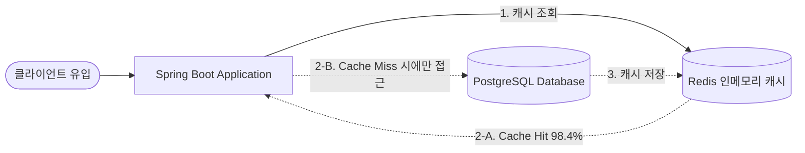

> 💡 <strong>안내</strong>: 본 포스팅은 실무에서 겪은 백엔드 트러블슈팅 경험과 학습 내용을 바탕으로, 기술적 이해와 설명의 명확성을 돕기 위해 <strong>실제 내용에 일부 가상의 시나리오와 설정을 덧붙여 각색·재구성</strong>한 글입니다.

## 💥 1. 발단: 마케팅 광고, 그리고 갑작스러운 DB 장애

서비스 활성화를 위해 마케팅 프로모션과 광고를 시작했습니다. 광고가 시작되자 평소보다 <strong>더 많은 유입 트래픽</strong>이 메인 홈 화면으로 집중되었습니다.

하지만 유입 트래픽이 늘어나자 백엔드 모니터링 대시보드에 경고등이 켜지며 <strong>데이터베이스(PostgreSQL)가 버티지 못하고 뻗어버리는 심각한 장애</strong>가 발생했습니다.

### 📱 메인 화면의 다중 조회 API 호출 구조
메인 홈 화면은 사용자에게 다양한 정보를 한 번에 보여주기 위해 화면 1개가 로딩될 때 다음과 같이 여러 개의 조회 API를 동시에 호출하고 있었습니다:

1. <strong>상단 배너 및 공지사항 조회 API</strong> (`/api/v1/main/banners`)
2. <strong>실시간 인기 상품 TOP 10 조회 API</strong> (`/api/v1/main/popular-products`)
3. <strong>추천 카테고리 및 기획전 목록 조회 API</strong> (`/api/v1/main/promotions`)

사용자 1명이 메인 화면에 접속할 때마다 최소 <strong>3\~4개의 조회 API</strong>가 동시에 데이터베이스로 요청을 보냈고, 동시 접속자가 몰리자 다음과 같은 연쇄 병목이 일어났습니다.

```text
[ 트래픽 증가 시 발생한 연쇄 장애 메커니즘 ]
1. 유저 동시 유입 ➔ 화면당 3~4개 조회 API가 동시 발송되며 트래픽 수배 증폭
2. Spring Boot ➔ PostgreSQL 간 HikariCP Connection Pool (기본 10개) 0.1초 만에 완전 고갈
3. 스레드들이 커넥션을 얻지 못해 무한 대기 (ConnectionTimeoutException 발생)
4. 저스펙 CPU에서 수백 개 스레드의 커넥션 쟁탈전(컨텍스트 스위칭)으로 CPU 점유율 100% 도달
5. 메인 화면뿐만 아니라 동일 DB를 공유하는 '결제/주문/로그인' 기능까지 전면 마비! 🚨
```

---

## 🔍 2. 원인 분석: 빠른 쿼리(5ms)에도 커넥션이 마르는 이유

단순 조회 위주의 화면이라 별도의 무거운 트랜잭션이 없고 DB SELECT 쿼리 자체는 인덱스를 타고 5ms 만에 빠르게 처리되고 있었습니다. 그럼에도 불구하고 왜 DB 커넥션 풀이 마르고 시스템이 다운되었을까요?

### ⚠️ 원인 1: 화면 1개당 3\~4개 API 호출로 인한 '트래픽 4배 증폭'
* 사용자는 1명이 들어왔지만, 브라우저가 화면을 렌더링하기 위해 API 3\~4개를 동시에 호출합니다.
* 즉, <strong>실제 유입된 유저 수보다 3\~4배나 많은 DB 커넥션 요청이 찰나의 순간에 쏟아지는 증폭 현상</strong>이 발생했습니다.

### ⚠️ 원인 2: 저스펙 서버 환경과 커넥션 풀(10개)의 물리적 수학적 한계
동시에 필요한 DB 커넥션의 개수는 <strong>리틀의 법칙(Little's Law)</strong>에 의해 결정됩니다:

> <strong>필요 커넥션 수 = 초당 요청 수 (RPS) × 요청 1건당 DB 소요 시간 (초)</strong>

* <strong>정상 상황</strong>: 초당 100건(RPS) 유입 시 ➔ `100 × 0.005초 = 0.5개` (기본 커넥션 10개로 널널하게 처리)
* <strong>광고 트래픽 증가</strong>: 초당 3,000건(RPS) 유입 시 ➔ `3,000 × 0.005초 = 15개` (필요 커넥션 급증)
* 쿼리가 5ms로 아무리 빨라도, <strong>가진 커넥션(10개)보다 필요한 커넥션(15\~30개)이 많아지는 순간</strong> 대기 큐가 꽉 차며 30초 후 `ConnectionTimeoutException`이 폭발하게 됩니다.

### ⚠️ 원인 3: 저스펙 CPU의 스레드 락 경합 및 컨텍스트 스위칭 부하
* Spring Boot(Tomcat)의 기본 스레드 풀은 200개인데, PostgreSQL과 연결된 통로(HikariCP)는 10개뿐이었습니다.
* CPU 코어가 적은 저스펙 서버 환경에서 200개의 스레드가 10개의 커넥션을 차지하려고 아귀다툼(Lock Contention)을 벌이면서, <strong>CPU가 실제 쿼리 처리가 아닌 스레드 간 전환(Context Switching)에 80% 이상의 자원을 낭비</strong>하여 시스템 전체가 굳어버렸습니다.

### ⚠️ 원인 4: 불필요한 반복 쿼리 (준 정적 데이터)
* 상단 배너, 공지사항, 기획전 카테고리는 모든 사용자에게 99.9% 동일하게 보이는 <strong>준(準) 정적 데이터</strong>임에도 불구하고, 모든 요청마다 매번 DB 커넥션을 획득하여 쿼리를 날리고 있었습니다.

### 📐 아키텍처 개선 방향: Look-Aside 캐싱 도입
데이터베이스 앞단에 초고속 인메모리 저장소인 <strong>Redis</strong>를 배치하고, <strong>Look-Aside (Cache-Aside)</strong> 패턴을 적용하여 <strong>DB 커넥션 풀을 아예 건드리지 않고 인메모리에서 0.001초 만에 즉시 반환</strong>하기로 결정했습니다.



---

## 🛠️ 3. 해결 과정: Lettuce 기반 Redis 캐시 도입과 실무 코드

### 1) 왜 Jedis 대신 Lettuce인가?
Spring Boot의 Redis 클라이언트로는 과거에 널리 쓰이던 `Jedis`와 현재 기본 표준인 `Lettuce`가 있습니다. 대용량 동시성 환경에서는 <strong>Lettuce가 압도적으로 유리</strong>합니다.

| 비교 항목 | Jedis | Lettuce (선택 ✅) |
| :--- | :--- | :--- |
| <strong>동작 방식</strong> | 동기식 / 블로킹 I/O | <strong>비동기 / 논블로킹 I/O (Netty 기반)</strong> |
| <strong>커넥션 관리</strong> | 스레드마다 커넥션 1:1 필요 (`JedisPool` 관리 비용 큼) | <strong>다중 스레드가 단일 커넥션 채널을 공유 (Multiplexing)</strong> |
| <strong>동시성 처리</strong> | 동시 요청 증가 시 커넥션 풀 고갈 위험 | <strong>적은 리소스로 수많은 동시 요청 가볍게 처리</strong> |
| <strong>스레드 안정성</strong> | Thread-Safe 하지 않음 | <strong>완벽한 Thread-Safe 지원</strong> |

---

### 2) Redis & CacheManager 설정 (`RedisConfig.java`)
데이터의 비즈니스 성격에 따라 만료 시간(TTL)을 세밀하게 분기하고, 객체 직렬화 포맷을 지정했습니다.

```java
package com.example.config;

import org.springframework.beans.factory.annotation.Value;
import org.springframework.cache.annotation.EnableCaching;
import org.springframework.context.annotation.Bean;
import org.springframework.context.annotation.Configuration;
import org.springframework.data.redis.cache.RedisCacheConfiguration;
import org.springframework.data.redis.cache.RedisCacheManager;
import org.springframework.data.redis.connection.RedisConnectionFactory;
import org.springframework.data.redis.connection.lettuce.LettuceConnectionFactory;
import org.springframework.data.redis.serializer.GenericJackson2JsonRedisSerializer;
import org.springframework.data.redis.serializer.RedisSerializationContext;
import org.springframework.data.redis.serializer.StringRedisSerializer;

import java.time.Duration;
import java.util.HashMap;
import java.util.Map;

@Configuration
@EnableCaching
public class RedisConfig {

    @Bean
    public RedisConnectionFactory redisConnectionFactory(
            @Value("${spring.data.redis.host:localhost}") String host,
            @Value("${spring.data.redis.port:6379}") int port) {
        return new LettuceConnectionFactory(host, port);
    }

    @Bean
    public RedisCacheManager cacheManager(RedisConnectionFactory connectionFactory) {
        // 1. 기본 캐시 정책: JSON 직렬화 적용 및 null 값 캐싱 방지
        RedisCacheConfiguration defaultConfig = RedisCacheConfiguration.defaultCacheConfig()
                .entryTtl(Duration.ofMinutes(10))
                .disableCachingNullValues()
                .serializeKeysWith(RedisSerializationContext.SerializationPair.fromSerializer(new StringRedisSerializer()))
                .serializeValuesWith(RedisSerializationContext.SerializationPair.fromSerializer(new GenericJackson2JsonRedisSerializer()));

        // 2. 데이터 성격별 TTL 커스텀 설정
        Map<String, RedisCacheConfiguration> customConfigs = new HashMap<>();
        
        // 배너/기획전: 수정이 드문 데이터이므로 1시간 캐싱 (DB 부하 0)
        customConfigs.put("mainBanners", defaultConfig.entryTtl(Duration.ofHours(1)));
        customConfigs.put("mainPromotions", defaultConfig.entryTtl(Duration.ofHours(1)));
        
        // 실시간 인기 랭킹: 정합성을 고려하여 1분 주기로 갱신
        customConfigs.put("popularProducts", defaultConfig.entryTtl(Duration.ofMinutes(1)));

        return RedisCacheManager.builder(connectionFactory)
                .cacheDefaults(defaultConfig)
                .withInitialCacheConfigurations(customConfigs)
                .build();
    }
}
```

---

### 3) 서비스 계층에 `@Cacheable` 적용 (`MainDisplayService.java`)
Spring의 캐시 추상화 어노테이션을 활용하여, <strong>반복 쿼리 실행을 방지하고 캐시된 결과를 즉시 반환</strong>하도록 구성했습니다.

```java
package com.example.service;

import com.example.dto.BannerDto;
import com.example.dto.ProductSummaryDto;
import com.example.repository.BannerRepository;
import com.example.repository.ProductRepository;
import lombok.RequiredArgsConstructor;
import org.springframework.cache.annotation.Cacheable;
import org.springframework.stereotype.Service;

import java.util.List;

@Service
@RequiredArgsConstructor
public class MainDisplayService {

    private final BannerRepository bannerRepository;
    private final ProductRepository productRepository;

    // 배너 조회: 1시간 동안 Redis 인메모리에서 즉각 반환 (DB 커넥션 소모 0)
    @Cacheable(value = "mainBanners", key = "'active'", unless = "#result == null || #result.isEmpty()")
    public List<BannerDto> getActiveBanners() {
        return bannerRepository.findAllActiveBanners()
                .stream()
                .map(BannerDto::from)
                .toList();
    }

    // 인기 상품 TOP 10: 1분간 캐싱되어 초당 수천 번의 랭킹 쿼리로부터 커넥션 풀 보호
    @Cacheable(value = "popularProducts", key = "'top10'", unless = "#result == null || #result.isEmpty()")
    public List<ProductSummaryDto> getPopularProducts() {
        return productRepository.findTop10BySales()
                .stream()
                .map(ProductSummaryDto::from)
                .toList();
    }
}
```

---

### 4) 실무 운영을 위한 필수 Lettuce 타임아웃 튜닝
실무 환경에서는 Redis 자체가 일시적인 네트워크 지연이나 장애를 겪을 때, <strong>백엔드 애플리케이션 스레드가 응답을 기다리며 줄줄이 블로킹되는 2차 대형 사고</strong>를 반드시 방지해야 합니다. 이를 위해 커넥션 및 커맨드 타임아웃을 명시적으로 제한했습니다.

```java
package com.example.config;

import io.lettuce.core.ClientOptions;
import io.lettuce.core.SocketOptions;
import org.springframework.context.annotation.Bean;
import org.springframework.context.annotation.Configuration;
import org.springframework.data.redis.connection.RedisStandaloneConfiguration;
import org.springframework.data.redis.connection.lettuce.LettuceClientConfiguration;
import org.springframework.data.redis.connection.lettuce.LettuceConnectionFactory;

import java.time.Duration;

@Configuration
public class LettuceTuningConfig {

    @Bean
    public LettuceConnectionFactory tunedLettuceConnectionFactory() {
        // 1. 소켓 연결 타임아웃 (0.5초)
        SocketOptions socketOptions = SocketOptions.builder()
                .connectTimeout(Duration.ofMillis(500))
                .build();

        ClientOptions clientOptions = ClientOptions.builder()
                .socketOptions(socketOptions)
                .autoReconnect(true)
                .build();

        // 2. 명령어 실행 타임아웃 (1초 초과 시 빠른 Fail-Fast 처리)
        LettuceClientConfiguration clientConfig = LettuceClientConfiguration.builder()
                .clientOptions(clientOptions)
                .commandTimeout(Duration.ofMillis(1000))
                .build();

        RedisStandaloneConfiguration serverConfig = new RedisStandaloneConfiguration("10.0.1.50", 6379);
        return new LettuceConnectionFactory(serverConfig, clientConfig);
    }
}
```

---

## 📊 4. 개선 결과 및 효과

캐싱 아키텍처 적용 후 부하 테스트 및 실제 마케팅 라이브 트래픽 유입 시 측정한 지표 비교입니다:

| 지표 항목 | 캐싱 적용 전 (장애 상황) | 캐싱 적용 후 (안정화) | 개선 효과 |
| :--- | :--- | :--- | :--- |
| <strong>DB CPU 사용률</strong> | <strong>95%\~100% (포화 다운)</strong> | <strong>15%\~20% (극도로 안정)</strong> | <strong>부하 약 80% 감소</strong> |
| <strong>HikariCP 커넥션 대기</strong> | `ConnectionTimeout` 빈번 발생 | <strong>대기 스레드 0건</strong> | <strong>병목 완벽 해소</strong> |
| <strong>API 평균 응답 속도</strong> | <strong>850ms \~ 3,000ms+</strong> | <strong>12ms \~ 25ms</strong> | <strong>응답 속도 97% 단축</strong> |
| <strong>Cache Hit Ratio</strong> | 0% (매번 DB 직격) | <strong>98.4%</strong> | <strong>대부분 인메모리 처리</strong> |

광고로 인해 많은 사용자가 유입되었음에도, 메인 홈 화면 조회의 <strong>98% 이상이 Redis 인메모리에서 0.01초 만에 응답</strong>되면서 한정된 커넥션 풀(10개)을 전혀 점유하지 않고도 수천 건의 동시 요청을 가볍게 통과시킬 수 있게 되었습니다.

---

## 💡 5. 12세 청소년도 쉽게 이해하는 비유 (ELI12)

> <strong>"아무리 1초 만에 표를 끊어주는 초고속 매표원(5ms 빠른 쿼리)이라도, 매표 창구가 10개(커넥션 풀)밖에 없는데 손님이 2,000명 몰려오면 놀이공원 입구가 마비되는 것과 똑같습니다!"</strong>
>
> - <strong>Lettuce + Redis 캐싱이 마법인 이유</strong>: 
>   - 10개뿐인 매표소(DB 커넥션)로 손님을 보내지 않고, <strong>입구에 무인 발권기(Redis 캐시)를 설치해 모든 손님이 0.001초 만에 표를 뽑아가게 만든 것</strong>입니다.
>   - 저스펙 서버라도 커넥션을 전혀 쓰지 않고 수만 명의 손님을 막힘없이 통과시키게 되었습니다!

---

## 🎯 6. 마치며: 배운 점과 다음 스텝

### 💡 실무 교훈
1. <strong>쿼리가 빨라도 커넥션 풀의 물리적 한계(RPS 증폭)는 피할 수 없다</strong>:
   - 화면당 다중 API 호출로 인한 트래픽 증폭 환경에서는 아무리 단순 SELECT 쿼리라도 커넥션 풀 고갈을 피하기 어려우며, 인메모리 캐싱을 통해 <strong>DB 진입 자체를 차단하는 것이 가장 확실한 해법</strong>입니다.
2. <strong>Lettuce의 비동기 커넥션 공유 특성</strong>:
   - 커넥션 풀을 무작정 늘리지 않고도 단일 커넥션의 Netty 이벤트 루프를 통해 많은 동시 요청을 가볍게 소화할 수 있었습니다.

### 🚀 추가 고도화 고민 (Next Step)
* <strong>Cache Stampede (캐시 스탬피드) 방어</strong>:
   - 인기 상품 캐시(TTL 1분)가 만료되는 순간 많은 요청이 일시에 DB로 쏟아지는 현상을 방지하기 위해, 만료 시간에 <strong>랜덤 지터(Random Jitter)</strong>를 부여하거나 <strong>Redisson 분산 락</strong>을 활용한 단일 스레드 갱신 구조를 추가 적용할 예정입니다.
* <strong>Redis 장애 시 Circuit Breaker</strong>:
   - 캐시 서버가 다운되더라도 메인 애플리케이션이 멈추지 않고 안전하게 Fallback 정적 데이터를 반환할 수 있도록 Resilience4j 기반의 서킷 브레이커 연동을 준비하고 있습니다.
