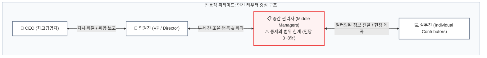
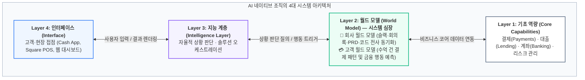
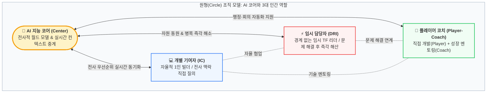
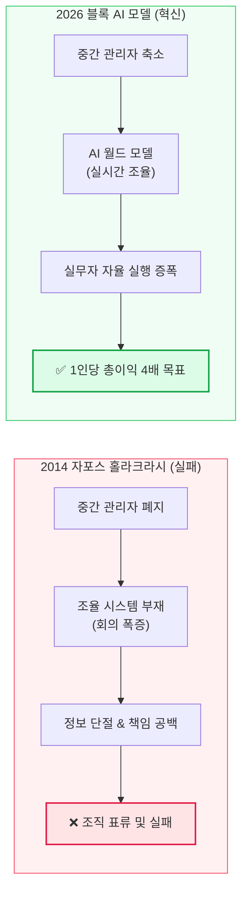

## ⚡ 실적이 좋은데 직원 40%를 잘랐다? 잭 도시의 파격 선언

2026년 초, 글로벌 핀테크 공룡 기업 <strong>블록(Block, 구 Square)</strong>은 글로벌 테크 업계 전체를 충격에 빠뜨린 결정을 발표했습니다. 회사의 분기 실적과 총이익이 견고한 성장세를 유지하고 있음에도 불구하고, <strong>전체 임직원의 40%에 달하는 4,000명 이상의 인력을 일시에 감원</strong>한 것입니다. 1만 명이 넘던 회사는 단숨에 6,000명 이하의 컴팩트한 조직으로 재편되었습니다.

경영 위기에 빠진 기업들이 생존을 위해 허리띠를 졸라매는 통상적인 구조조정과는 차원이 달랐습니다. 트위터(현 X)와 블록의 창업자이자 CEO인 <strong>잭 도시(Jack Dorsey)</strong>는 이 대규모 감원의 목적을 명확히 밝혔습니다.

> <strong>"이번 인력 감축은 재정난 때문이 아닙니다. 사내에 AI 에이전트와 지능 레이어를 전면 도입하여, 2,000년간 이어진 기업의 계층 구조 자체를 완전히 재설계하기 위함입니다. 우리의 목표는 직원 1인당 총이익을 기존 50만 달러에서 200만 달러(약 27억 원)로 4배 끌어올리는 것입니다."</strong>

그리고 2026년 3월 31일, 잭 도시는 실리콘밸리 최고의 벤처캐피털 세쿼이아 캐피털(Sequoia Capital)의 수장이자 블록의 이사회 멤버인 <strong>룰로프 보타(Roelof Botha)</strong>와 함께 한 편의 기념비적인 매니페스토를 공동 발표했습니다.

그 글의 제목은 바로 <strong>《From Hierarchy to Intelligence: A New Operating Model for Companies in the AI Era (계층에서 지능으로: AI 시대 기업을 위한 새로운 운영 모델)》</strong>이었습니다.

잭 도시는 왜 중간 관리자를 없애려 할까요? AI 에이전트가 회사의 중심이 되는 조직은 구체적으로 어떻게 굴러가는 것일까요? 블록의 파격적인 실험과 4대 조직 아키텍처를 심층 분석해 드립니다.

---

## 🏛️ 1. 역사적 진단: 피라미드 계층 구조는 '인간 라우팅 프로토콜'에 불과했다

잭 도시와 룰로프 보타는 현대 기업들이 관성적으로 따르고 있는 피라미드형 조직도(Org Chart)의 기원부터 파고듭니다.

### 1) 2,000년 전 로마 군단과 프로이센 참모본부의 유산
오늘날 우리가 익숙한 '팀원 ➔ 팀장 ➔ 실장 ➔ 본부장 ➔ 대표'로 이어지는 수직 계층 구조는 비즈니스를 위해 발명된 것이 아닙니다. 2,000년 전 <strong>고대 로마 군대의 백인대(Centuria)</strong>와 19세기 <strong>프로이센 군대의 참모본부 체제</strong>에서 건너온 군사적 유산입니다.

이러한 계층이 만들어진 유일한 이유는 인간의 생물학적 인지 한계, 즉 <strong>'통제의 범위(Span of Control)'</strong> 때문이었습니다. 심리학과 경영학 연구에 따르면, 한 명의 인간 리더가 깊이 있게 소통하고 직접 관리할 수 있는 부하 직원의 수는 기껏해야 <strong>3\~8명</strong>에 불과합니다. 회사의 규모가 100명, 1,000명, 10,000명으로 커지면 필연적으로 관리자 위에 또 다른 관리자를 얹는 '피라미드 계층'을 쌓을 수밖에 없었던 것입니다.

### 2) 중간 관리자의 본질은 '인간 정보 라우터'였다
잭 도시는 중간 관리자가 수행하던 핵심 업무를 냉정하게 정의합니다.
* 위에서 내려오는 전략과 지시를 아래로 전달(Relay)하기
* 밑에서 일어나는 수많은 실무 데이터를 취합하고 요약해서 위로 보고(Aggregate)하기
* 서로 다른 부서 간의 이해관계를 조율(Coordinate)하기

즉, 전통적 계층 구조는 효율적인 의사결정 기구가 아니라, <strong>인간의 좁은 대역폭을 극복하기 위해 어쩔 수 없이 고안된 '인간 정보 라우팅 프로토콜(Information Routing Protocol)'</strong>이었습니다.

하지만 통신망에서 라우터 홉(Hop)이 늘어날수록 레이턴시(지연 시간)가 길어지고 패킷 손실이 일어나듯, 조직의 계층이 깊어질수록 현장의 생생한 데이터는 왜곡되고, 사내 정치가 싹트며, 혁신의 속도는 느려집니다. 잭 도시는 <strong>"정보를 취합·요약·전달·조율하는 일이라면, 이제 AI 에이전트가 인간보다 수천 배 더 빠르고 정확하게 해낼 수 있다"</strong>고 선언합니다.

---

## 🏗️ 2. AI 네이티브 조직의 4대 레이어 (조직의 새로운 아키텍처)

잭 도시와 룰로프 보타가 제시하는 미래의 회사는 수직 피라미드가 아니라, <strong>소프트웨어 스택처럼 계층화된 4개의 시스템 레이어</strong>로 동작합니다.

### 1) Layer 1: 기초 역량 (Core Capabilities)
회사가 세상에 제공하는 본질적인 비즈니스 블록들입니다. 블록(Block)의 경우 카드 결제 승인, 가맹점 대출, 급여 입금 계좌 개설, 비트코인 거래 인프라 등이 여기에 해당합니다.

### 2) Layer 2: 월드 모델 (World Model) — 시스템의 심장
이 아키텍처의 가장 핵심적인 두뇌입니다. 두 가지 차원의 모델이 실시간으로 동기화됩니다.
* <strong>회사 월드 모델 (Company World Model):</strong> 회사의 모든 슬랙 대화, 회의 녹취록, 지라 티켓, PRD(제품 기획서), 깃허브 코드 커밋, 이사회 회의록을 실시간으로 학습합니다. 회사의 현재 전략이 무엇이고, 어떤 팀이 무엇을 만들고 있으며, 어디서 병목이 발생했는지를 100% 꿰뚫고 있는 전사적 지식 베이스입니다. (블록 사내의 자체 AI 에이전트 <strong>'구스(Goose)'</strong> 등이 이 역할을 수행합니다.)
* <strong>고객 월드 모델 (Customer World Model):</strong> 수천만 명의 소상공인과 소비자가 일으키는 수억 건의 결제 데이터, 매출 변동, 잔고 추이를 실시간 분석하여 고객의 다음 금융 행동과 유동성 위험을 사전에 예측합니다.

### 3) Layer 3: 지능 계층 (Intelligence Layer)
월드 모델에서 얻은 통찰을 바탕으로, 인간 관리자의 수동 결재 없이도 최적의 행동을 자율적으로 조율(Orchestration)합니다. 예를 들어 어떤 소상공인의 재고 소진 속도가 빨라지면, 인간 담당자가 보고서를 올리지 않아도 지능 레이어가 먼저 "단기 운전자금 대출 3,000만 원"을 계산하여 가맹점 POS 화면에 제안합니다.

### 4) Layer 4: 인터페이스 (Interface)
고객과 직원이 실제로 손을 대는 접점입니다. 모바일 앱(Cash App), 웹 대시보드, 판매자용 POS 단말기가 여기에 해당합니다.

---

## 👥 3. AI 시대 인간 직원의 3가지 새로운 역할: '원형(Circle) 조직'

관리 계층이 5단계에서 2\~3단계로 압축되고 정보 라우팅을 AI가 도맡는다면, 회사에 남은 인간 직원들은 무슨 일을 해야 할까요?

잭 도시는 조직의 형태가 <strong>피라미드에서 '원형(Circle)'으로 전환</strong>된다고 설명합니다. <strong>AI가 원의 중심(Center)에 자리 잡아 모든 정보와 맥락을 실시간으로 중계하고, 인간 직원들은 원의 가장자리(Edge)에서 실제 가치를 창출하는 실무에 몰입</strong>하는 구조입니다.

이 체제에서 인간은 오직 3가지 역할 중 하나로만 존재합니다:

### 1) 개별 기여자 (Individual Contributor, IC) — 자율적 빌더
과거의 IC는 상사가 일을 쪼개서 지시해주기를 기다려야 했습니다. 회사의 전체 맥락을 알 수 없었기 때문입니다.  
하지만 AI 조직의 IC는 <strong>'회사 월드 모델'에 직접 질의하여 회사의 최신 우선순위와 전사적 맥락을 실시간으로 완벽하게 파악</strong>합니다. 결재권자의 눈치를 보지 않고, AI의 지능을 도구 삼아 직접 판단하고 기획하며 완결된 제품과 코드를 만드는 강력한 1인 메이커로 거듭납니다.

### 2) 직접 책임자 / 임시 담당자 (DRI: Directly Responsible Individual)
기존 조직에서는 부서 간 협업 프로젝트 하나를 돌리려면 팀장, 본부장 간의 지난한 회의와 의전이 필요했습니다.  
DRI는 <strong>특정 문제나 기회가 포착되었을 때 조직의 경계를 허물고 자원을 즉각 끌어모아 해결하는 임시 프로젝트 리더</strong>입니다. 상설 직책이 아니며, 과제가 완수되면 프로젝트 팀은 쿨하게 해산하고 본래의 전문 영역으로 흩어집니다.

### 3) 플레이어 코치 (Player-Coach) — 실무를 놓지 않는 멘토
회의 주관, 일정 체크, 휴가 결재, 근태 관리 등 전통적 관리자의 행정 업무는 100% AI 에이전트가 자동 처리합니다.  
따라서 리더에게 남겨진 역할은 단 두 가지입니다:  
① 본인 스스로도 아키텍처를 설계하거나 코드를 짜는 <strong>최고 수준의 실무자(Player)</strong>일 것.  
② 팀원들의 기술적 성장, 심리적 안정, 커리어 개발을 지원하는 <strong>진정한 의미의 멘토(Coach)</strong>일 것.

---

## ⚔️ 4. 자포스의 실패 vs 블록의 도전: 이번엔 진짜 다를까?

조직에 관심이 많은 분이라면 잭 도시의 이 구상을 보며 10여 년 전의 유명한 사건을 떠올릴 것입니다. 바로 온라인 신발 쇼핑몰 <strong>자포스(Zappos)의 '홀라크라시(Holacracy, 무관리자 자율 조직)' 실험</strong>입니다.

당시 자포스는 모든 직급과 관리자를 폐지하고 수평적 자율 조직을 선언했으나, 얼마 지나지 않아 심각한 혼란과 인재 유출을 겪으며 사실상 실패로 끝났습니다. 왜 그랬을까요?

| 비교 항목 | 2014년 자포스의 홀라크라시 | 2026년 잭 도시의 블록(Block) 모델 |
| :--- | :--- | :--- |
| <strong>정보 조율 주체</strong> | <strong>인간 회의체 (인간 간 조율)</strong> | <strong>AI 에이전트 & 회사 월드 모델</strong> |
| <strong>핵심 실패 원인</strong> | 관리자가 사라지자 정보가 단절되고 책임 소재 불분명 | AI가 24시간 실시간 컨텍스트 중계 및 의사결정 데이터 제공 |
| <strong>목표 지표</strong> | 수평적 사내 민주주의, 유연성 | <strong>1인당 총이익 4배 점프 ($50만 ➔ $200만)</strong> |
| <strong>운영 체제</strong> | 서면 규칙집(Holacracy Constitution) | 소프트웨어 지능 레이어(Goose 등 AI 스택) |

자포스의 실험이 실패했던 근본 원인은 <strong>"중간 관리자를 없앴지만, 그들이 하던 '정보 조율'의 공백을 메울 대안이 없었기 때문"</strong>이었습니다. 매일 회의만 하다가 하루가 끝났습니다.

잭 도시의 가설은 명확합니다. <strong>"인간이 하던 조율의 빈자리를, 편견도 피로도 없고 1초 만에 전사 데이터를 읽어내는 AI 월드 모델이 메운다면 사상 최초로 관리자 없는 대규모 고효율 조직이 실현될 수 있다"</strong>는 것입니다.

---

## ⚠️ 5. 장밋빛 환상인가, 냉혹한 현실인가? 직면한 3가지 난제

잭 도시의 실험은 매혹적이지만, 테크 업계와 경영학계에서는 신중론과 회의론 역시 거세게 일고 있습니다.

### 1) '회사 월드 모델'의 완벽성 한계
고객의 결제 데이터는 정형화된 숫자이므로 AI가 쉽게 학습합니다. 하지만 <strong>회사의 사내 역학은 수치화되지 않는 암묵지(Tacit Knowledge), 미묘한 인간적 신뢰, 정치적 타협</strong>으로 가득 차 있습니다. 과연 AI 에이전트가 "저 팀이 왜 저 제안을 완곡하게 거절했는지"의 행간을 100% 이해하고 전사 조율을 해낼 수 있을지는 여전히 미지수입니다.

### 2) AI 인프라 추론 비용의 역설 (Inference Cost)
인간 엔지니어와 관리자의 인건비를 아끼려다, <strong>수천 대의 GPU 클러스터와 대규모 모델 추론 비용(API Cost)으로 그 이상의 돈을 지출하게 될 수 있다</strong>는 지적입니다. AI 운영비가 인간 인건비보다 저렴해지는 골든 크로스가 언제 올 것인가가 실질적인 재무적 성패를 가를 것입니다.

### 3) 생존자들의 번아웃과 조직 문화 붕괴
동료 40%가 잘려 나간 상황에서 남겨진 6,000명의 직원들은 극심한 스트레스와 <strong>'1인당 4배의 이익을 내야 한다'는 무거운 압박감</strong>을 안게 됩니다. AI 도구가 충분히 성숙하지 않은 과도기에 실무자들에게 과부하가 걸려 핵심 인재들이 이탈할 위험도 배제할 수 없습니다.

---

## 🏁 6. 총평: 모든 기업이 '미니 AGI'가 되는 시대의 서막

잭 도시는 세쿼이아 팟캐스트에서 한 문장으로 자신의 비전을 압축했습니다.

> <strong>"이제 모든 기업은 그 자체로 하나의 미니 AGI(인공일반지능)가 될 수 있습니다."</strong>

지금까지 기업의 경쟁력은 '우수한 인재를 얼마나 많이 뽑아 거대한 피라미드를 쌓았는가'에 달려 있었습니다. 하지만 생성형 AI와 에이전트 기술이 성숙해진 지금, 승부처는 <strong>'얼마나 얇은 계층 구조 위에서, 얼마나 강력한 지능 레이어로 인간 실무자의 능력을 수십 배 증폭시킬 수 있는가'</strong>로 완전히 이동하고 있습니다.

블록의 이번 실험이 위대한 성공으로 끝날지, 아니면 지나치게 앞서간 이상주의적 시도로 남을지는 앞으로 1\~2년간의 실적 발표가 말해줄 것입니다.

하지만 한 가지는 분명합니다. <strong>"보고를 위한 보고, 회의를 위한 회의를 하던 전통적 관리자의 시대는 끝났다"</strong>는 사실입니다. AI 시대의 지식 근로자는 이제 위를 향해 결재판을 올리는 직장인이 아니라, 회사의 지능을 레버리지 삼아 직접 가치를 만들어내는 <strong>자율적 빌더이자 플레이어 코치</strong>로 거듭나야 합니다.
