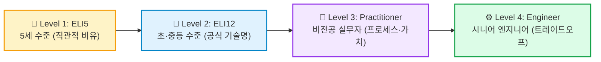

## 👶 1. 'ELI5'란 무엇인가? 인터넷 유행어에서 AI 시대 필수 프롬프트로

생성형 AI(ChatGPT, Claude, Gemini)와 대화할 때 최신 테크 커뮤니티와 글로벌 직장인들 사이에서 가장 뜨겁게 회자되는 마법의 키워드가 있습니다. 바로 <strong>ELI5</strong>입니다.

| 항목 | 핵심 내용 |
| :--- | :--- |
| <strong>풀이</strong> | <strong>Explain Like I'm 5</strong> (영미권 인터넷 신조어 및 프롬프트 약어) |
| <strong>직관적 의미</strong> | "내가 마치 <strong>다섯 살짜리 아이</strong>라고 생각하고 눈높이에 맞춰 설명해 줘" |
| <strong>핵심 본질</strong> | 어려운 전문 용어(Jargon), 난해한 수식, 추상화를 완전히 걷어내고, <strong>누구나 일상에서 만질 수 있는 직관적 비유로 개념의 알맹이만 전달</strong>하는 기법 |

### 1) ELI5의 기원: Reddit의 전설적인 서브레딧 `r/explainlikeimfive`
ELI5는 원래 2011년 글로벌 커뮤니티 레딧(Reddit)의 서브레딧 [`r/explainlikeimfive`](https://www.reddit.com/r/explainlikeimfive)에서 탄생했습니다. 

"상대성 이론이 도대체 뭐예요?", "금리가 오르면 왜 주가가 떨어지나요?" 같은 심오한 질문을 올리면, 전 세계의 전문가와 석학들이 <strong>"정말 5살 조카에게 장난감 블록으로 설명하듯"</strong> 답변을 달아주는 문화가 형성되었고, 현재 2,200만 명 이상의 구독자를 보유한 레딧 최대의 지식 허브로 성장했습니다.

### 2) 왜 2025\~2026년에 다시 폭발적으로 핫해졌는가?
최근 LLM(대형 언어 모델)의 지능이 비약적으로 발전하면서 역설적으로 <strong>'지식의 저주(Curse of Knowledge)'</strong> 문제가 대두되었습니다. 

AI에게 질문하면 위키백과나 논문을 그대로 복사한 듯한 딱딱한 전문 용어, 수많은 약어, 불필요하게 장황한 설명을 쏟아내어 비전공자가 핵심을 한눈에 파악하기 어렵기 때문입니다. 이때 프롬프트 끝에 <strong>"ELI5로 설명해 줘"</strong>라는 단 한 줄만 덧붙이면, AI는 불필요한 껍데기를 모두 태워버리고 <strong>가장 순수한 개념의 정수</strong>만을 도출해 냅니다.

---

## 🧠 2. 노벨상 물리학자 리처드 파인만과 ELI5의 뇌과학적 원리

ELI5는 단순한 유행어가 아닙니다. 20세기 최고의 천재 물리학자이자 교육자로 꼽히는 <strong>리처드 파인만(Richard Feynman)</strong>의 전설적인 학습 철학과 뇌과학적 원리가 그대로 녹아 있습니다.

<div class="feynman-diagram-container" style="margin: 36px 0; display: flex; justify-content: center; width: 100%;">
<svg viewBox="0 0 820 640" style="width: 100%; max-width: 820px; height: auto; font-family: -apple-system, BlinkMacSystemFont, 'Segoe UI', Roboto, Pretendard, sans-serif;" xmlns="http://www.w3.org/2000/svg">
<defs>
<marker id="arrow-down" viewBox="0 0 10 10" refX="5" refY="5" markerWidth="6" markerHeight="6" orient="auto-start-reverse">
<path d="M 0 1.5 L 8 5 L 0 8.5 z" fill="#38bdf8" />
</marker>
<marker id="arrow-up" viewBox="0 0 10 10" refX="5" refY="5" markerWidth="6" markerHeight="6" orient="auto">
<path d="M 0 8.5 L 8 5 L 0 1.5 z" fill="#38bdf8" />
</marker>
<filter id="card-shadow" x="-5%" y="-5%" width="110%" height="115%">
<feDropShadow dx="0" dy="2" stdDeviation="3" flood-opacity="0.08" />
</filter>
</defs>
<rect x="15" y="15" width="790" height="610" rx="16" fill="var(--bg-secondary, #18181b)" stroke="var(--border-glass-active, #3f3f46)" stroke-width="1.5" />
<g transform="translate(35, 48)">
<text x="0" y="0" font-size="16" font-weight="700" fill="var(--text-primary, #f4f4f5)" letter-spacing="-0.3px">
🎓 파인만 기법 (The Feynman Technique) 4단계 순환 모델
</text>
<line x1="-5" y1="16" x2="755" y2="16" stroke="var(--border-glass, #3f3f46)" stroke-width="1" />
</g>
<path d="M 430 152 L 430 204" fill="none" stroke="#94a3b8" stroke-width="2" marker-end="url(#arrow-down)" />
<path d="M 490 274 L 490 312 L 600 312 L 600 344" fill="none" stroke="#94a3b8" stroke-width="2" marker-end="url(#arrow-down)" />
<path d="M 490 414 L 490 452 L 430 452 L 430 484" fill="none" stroke="#94a3b8" stroke-width="2" marker-end="url(#arrow-down)" />
<path d="M 330 490 L 330 460 L 210 460 L 210 300 L 330 300 L 330 278" fill="none" stroke="#94a3b8" stroke-width="2" stroke-dasharray="6,5" />
<path d="M 330 286 L 330 276" fill="none" stroke="#94a3b8" stroke-width="2" marker-end="url(#arrow-up)" />
<g transform="translate(210, 382)">
<rect x="-95" y="-18" width="190" height="36" rx="10" fill="var(--bg-tertiary, #27272a)" stroke="var(--border-glass-active, #52525b)" stroke-width="1.5" filter="url(#card-shadow)" />
<text x="0" y="5" text-anchor="middle" font-size="11.5" font-weight="600" fill="var(--text-secondary, #e4e4e7)">
완전한 이해에 도달할 때까지 피드백
</text>
</g>
<g transform="translate(430, 120)" filter="url(#card-shadow)">
<rect x="-160" y="-32" width="320" height="64" rx="10" fill="var(--bg-secondary, #ffffff)" stroke="#64748b" stroke-width="2" />
<text x="0" y="-7" text-anchor="middle" font-size="14" font-weight="700" fill="var(--text-primary, #1e293b)">📝 [1단계: 개념 정의]</text>
<text x="0" y="15" text-anchor="middle" font-size="12" font-weight="500" fill="var(--text-muted, #64748b)">공부하고자 하는 개념을 종이 맨 위에 적는다</text>
</g>
<g transform="translate(430, 242)" filter="url(#card-shadow)">
<rect x="-180" y="-32" width="360" height="64" rx="10" fill="#fef3c7" stroke="#f59e0b" stroke-width="2" />
<text x="0" y="-7" text-anchor="middle" font-size="14" font-weight="700" fill="#92400e">👶 [2단계: 눈높이 설명]</text>
<text x="0" y="15" text-anchor="middle" font-size="12" font-weight="500" fill="#b45309">5살 아이에게 가르치듯 가장 쉬운 말과 일상 비유로 설명한다</text>
</g>
<g transform="translate(600, 382)" filter="url(#card-shadow)">
<rect x="-165" y="-32" width="330" height="64" rx="10" fill="#fef2f2" stroke="#ef4444" stroke-width="2" />
<text x="0" y="-7" text-anchor="middle" font-size="14" font-weight="700" fill="#991b1b">🔍 [3단계: 빈틈 포착]</text>
<text x="0" y="15" text-anchor="middle" font-size="12" font-weight="500" fill="#b91c1c">설명이 막히거나 전문 용어로 얼버무리는 지식의 착각 발견</text>
</g>
<g transform="translate(430, 522)" filter="url(#card-shadow)">
<rect x="-180" y="-32" width="360" height="64" rx="10" fill="#dbeafe" stroke="#3b82f6" stroke-width="2" />
<text x="0" y="-7" text-anchor="middle" font-size="14" font-weight="700" fill="#1e40af">🔄 [4단계: 단순화 및 정제]</text>
<text x="0" y="15" text-anchor="middle" font-size="12" font-weight="500" fill="#1d4ed8">원전으로 돌아가 부족한 부분을 메우고, 비유를 더 단순화한다</text>
</g>
</svg>
</div>

> <strong>"어떤 개념을 8살 아이에게 쉬운 말로 설명할 수 없다면, 당신은 그것을 제대로 이해하지 못한 것이다."</strong>  
> — 리처드 파인만 (Richard Feynman, 1965년 노벨 물리학상 수상자)

### 지식의 착각을 깨부수는 메타인지(Metacognition)
사람들은 어려운 용어를 외워 유창하게 읊을 때 '자신이 그 개념을 완전히 이해했다'고 착각합니다. 하지만 전문 용어라는 보호막을 빼앗기면 말문이 막히는 경우가 허다합니다.

ELI5는 화자(또는 AI)에게 <strong>'고차원적 추상화'를 '직관적인 물리적 실체(사탕, 장난감, 놀이터, 줄다리기)'로 다운그레이드 번역할 것을 강제</strong>합니다. 뇌과학적으로 이는 뇌의 작업 기억(Working Memory)에 걸리는 과도한 인지 부하를 해소하고, 장기 기억(Long-term Memory)에 이미 단단히 박혀 있는 일상 경험의 신경망과 새로운 지식을 직접 결합(Associative Learning)시키는 가장 강력한 학습 기법입니다.

---

## ⚡ 3. 실전 비교: 일반 AI 답변 vs ELI5 AI 답변

실제 세간을 뜨겁게 달구는 난해한 최신 기술 주제 3가지를 일반 프롬프트와 ELI5 프롬프트로 비교해 보면 그 차이가 확연히 드러납니다.

### 🔬 사례 1: 양자 얽힘 (Quantum Entanglement)

| 구분 | 일반 AI 프롬프트 답변 | ELI5 프롬프트 적용 답변 |
| :--- | :--- | :--- |
| <strong>설명 방식</strong> | 양자역학적 상태 함수, 파동함수 붕괴, 공간적 비국소성(Non-locality) 언급 | 마법의 동전 세트 비유 |
| <strong>실제 내용</strong> | "두 입자가 얽힘 상태에 있을 때, 한 입자의 스핀을 관측하여 결정되는 순간 공간적 거리에 무관하게 다른 입자의 스핀 상태가 즉각적으로 중첩에서 단일 고유상태로 붕괴합니다." | <strong>"가방 안에 빨간 공과 파란 공이 있어요. 눈을 감고 친구와 하나씩 나눠 가진 뒤, 친구는 미국으로 떠났어요. 내가 한국에서 내 주머니를 열어봤더니 '빨간 공'이에요. 그럼 친구에게 전화를 걸어보지 않아도 친구 주머니엔 무조건 '파란 공'이 들어있다는 걸 1초 만에 알 수 있죠? 둘이 아무리 멀리 떨어져 있어도 운명이 한 몸처럼 묶여 있는 게 바로 양자 얽힘이에요!"</strong> |

---

### ⛓️ 사례 2: 블록체인 (Blockchain)

| 구분 | 일반 AI 프롬프트 답변 | ELI5 프롬프트 적용 답변 |
| :--- | :--- | :--- |
| <strong>설명 방식</strong> | P2P 네트워크, SHA-256 암호학적 해시, PoW/PoS 합의 알고리즘 | 교실의 공동 일기장 비유 |
| <strong>실제 내용</strong> | "P2P 네트워크 기반의 분산 원장 기술로서, SHA-256 암호학적 해시 체인과 합의 알고리즘을 통해 데이터의 불변성을 보장하는 탈중앙화 인프라입니다." | <strong>"반 친구 30명이 모여 사탕 빌려준 내역을 적는 공책이에요. 반장 혼자 공책을 가지면 숫자를 몰래 고칠 수 있지만, 30명 모두가 똑같은 공책을 가지고 동시에 적는다면? 한 명이 '나 사탕 안 빌렸는데?' 거짓말을 해도 29명의 공책에 다 적혀 있어 절대 속일 수 없죠!"</strong> |

---

### 🤖 사례 3: 트랜스포머 AI의 셀프 어텐션 (Self-Attention)

| 구분 | 일반 AI 프롬프트 답변 | ELI5 프롬프트 적용 답변 |
| :--- | :--- | :--- |
| <strong>설명 방식</strong> | Query, Key, Value 행렬 연산, 소프트맥스 가중치 결합, 병렬 처리 | 시끄러운 생일 파티장의 귓속말 비유 |
| <strong>실제 내용</strong> | "입력 시퀀스의 각 토큰 간 상호 의존성을 쿼리(Query), 키(Key), 밸류(Value) 행렬 연산과 소프트맥스 가중치 결합을 통해 병렬적으로 계산하는 신경망 메커니즘입니다." | <strong>"100명이 떠드는 시끄러운 파티장에서도 저 멀리서 누군가 내 이름을 '민수야!' 부르면 그 소리만 귓가에 쏙 꽂히죠? AI가 긴 문장을 읽을 때도 모든 글자를 똑같은 힘으로 읽는 게 아니라, 주인공 단어와 가장 친하고 중요한 단어에만 돋보기를 비추듯 집중해서 귀를 기울이는 능력이 셀프 어텐션이에요."</strong> |

---

## 🚀 4. 2026년형 진화: '4단계 인지 사다리(Ladder)' 프롬프트 템플릿

단순히 "ELI5로 설명해줘"라고만 요청하면 너무 유아적인 단어만 나와서 실무나 깊이 있는 이해로 연결되지 못할 수 있습니다. 

최신 프롬프트 엔지니어링에서는 이를 극복하기 위해 <strong>'5세 ➔ 12세 ➔ 대학생 ➔ 현업 전문가'로 이어지는 4단계 인지 사다리 기법</strong>을 사용합니다:



아래 템플릿을 복사하여 AI에게 질문해 보세요:

```text
[ 4단계 인지 사다리 프롬프트 템플릿 ]

당신은 세계 최고의 교육자이자 테크 커뮤니케이터입니다.
제가 제시하는 개념에 대해 다음 4단계 계층 구조로 나누어 설명해 주세요.

1. [레벨 1 - ELI5 (5세 수준)]:
   - 전문 용어를 100% 배제하고, 장난감·음식·놀이터 등 일상적 사물에 빗댄 비유로 본질을 3문장 이내로 설명하세요.
2. [레벨 2 - ELI12 (초/중학생 수준)]:
   - 핵심적인 공식 기술 명칭을 1~2개 도입하고, 현실 세계에서 이 기술이 해결하는 구체적인 문제를 설명하세요.
3. [레벨 3 - 비전공 실무자 수준]:
   - 실제 시스템이 작동하는 단계별 프로세스(인풋 ➔ 처리 ➔ 아웃풋)와 왜 이 기술이 혁신적인지 설명하세요.
4. [레벨 4 - 시니어 엔지니어 수준]:
   - 이 아키텍처의 한계점, 트레이드오프(비용, 지연시간, 보안 등), 그리고 심화 구현 시 고려해야 할 엣지 케이스를 간결하게 정리하세요.

설명할 주제: [여기에 공부하고 싶은 주제 입력]
```

이 템플릿을 적용하면 <strong>직관적인 감각(Intuition)을 5초 만에 잡은 상태에서 점진적으로 테크니컬한 세부 사항까지 단숨에 장악</strong>할 수 있습니다.

---

## 🛠️ 5. 개발자를 위한 팁: Python의 `eli5` 머신러닝 라이브러리 (XAI)

많은 분들이 ELI5를 단순한 대화형 프롬프트로만 알고 있지만, 데이터 사이언스와 AI 엔지니어링 진영에는 <strong>`eli5`</strong>라는 실존하는 전설적인 Python 오픈소스 라이브러리가 있습니다.

```bash
# Python eli5 라이브러리 설치
pip install eli5
```

### 설명 가능한 AI (Explainable AI, XAI)의 대표 주자
머신러닝 모델(RandomForest, XGBoost, SVM 등)이나 자연어 처리 텍스트 분류기는 내부가 블랙박스로 되어 있어 "모델이 도대체 왜 이런 예측 결과를 내놓았는지" 인간이 알기 어렵습니다.

Python의 `eli5` 라이브러리는 모델의 가중치(Weights)와 피처 기여도(Feature Importance)를 분석하여, <strong>텍스트 문서에서 어떤 단어가 긍정/부정 판단에 결정적 역할을 했는지 초록색과 빨간색 하이라이트로 시각화</strong>해 줍니다:

```python
import eli5
from eli5.lime import TextExplainer

# 텍스트 분류기 모델의 예측 근거를 '5살 아이도 알 수 있게' 시각화
te = TextExplainer(random_state=42)
te.fit(sample_text, model.predict_proba)
te.show_prediction(target_names=['스팸', '정상'])
```

이처럼 ELI5는 단순한 밈을 넘어, <strong>"복잡한 블랙박스를 투명하고 알기 쉽게 인간에게 해설한다"</strong>는 현대 컴퓨터 과학의 핵심 화두(XAI)와 일맥상통합니다.

---

## 🎯 6. 결론: 지식 과잉의 시대, '단순함'이 가장 강력한 경쟁력이다

정보가 범람하고 하루가 멀다 하고 새로운 기술 용어가 쏟아져 나오는 AI 시대에, 진짜 실력자는 <strong>"어려운 지식을 어렵게 말하는 사람"</strong>이 아닙니다.  
<strong>"가장 복잡한 시스템의 코어를 5살 아이도 고개를 끄덕일 만큼 명쾌한 비유로 풀어낼 수 있는 사람"</strong>이야말로 진정으로 그 도메인을 지배하고 있는 전문가입니다.

오늘부터 공부하고 싶은 난해한 논문, 금융 상식, 코딩 아키텍처가 있다면 주저 없이 AI에게 외쳐보세요:

> <strong>"Explain Like I'm 5!"</strong>

그 짧은 문장 하나가 지식의 장벽을 허물고, 여러분의 뇌에 가장 직관적인 통찰의 불을 밝혀줄 것입니다.
